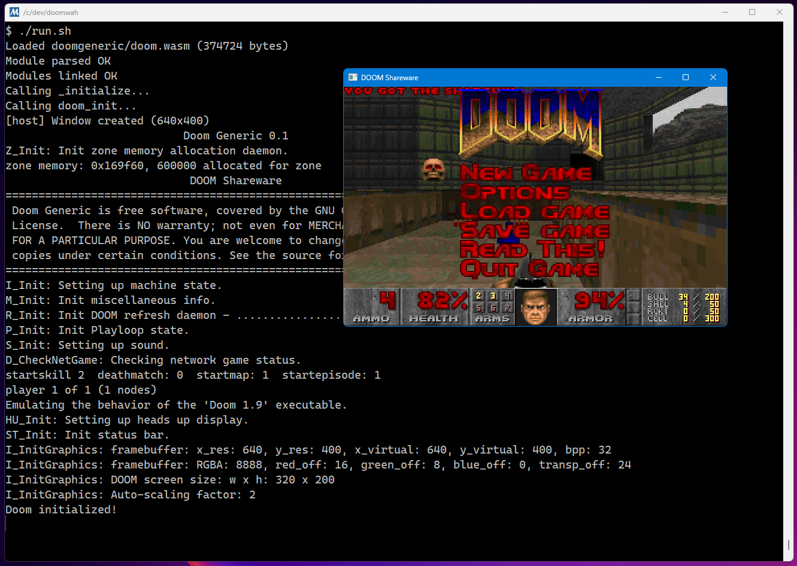

# DoomWAH

DOOM running as a standalone WebAssembly module, interpreted by [WAH](https://github.com/lifthrasiir/wah) on Windows.

The WASM guest has **zero runtime dependencies** — no WASI, no Emscripten JS glue, no libc internals.
All I/O (file, console, display) goes through 16 clean `host_*` imports.

Based on [doomgeneric](https://github.com/ozkl/doomgeneric) by ozkl.



## Dependencies

| Component | Tool | Notes |
|-----------|------|-------|
| WASM guest | [Emscripten](https://emscripten.org/) (`emcc`) | Compiles C to standalone WASM |
| Host runtime | GCC (MINGW64) | Compiles the Win32 host |
| WASM interpreter | [WAH](https://github.com/lifthrasiir/wah) | Single-header WebAssembly interpreter |
| Game data | `doom1.wad` | Shareware WAD (not included) |

## Building

All scripts run in **MINGW64 shell** (Git Bash) from the project root.

```bash
# 1. Build the WASM module (requires emcc in PATH)
bash build-wasm.sh

# 2. Build the host executable
bash build-host.sh
```

## Running

Place `doom1.wad` in the project root, then:

```bash
bash run.sh
```

Or directly:

```bash
./doomwah.exe doomgeneric/doom.wasm
```

## Architecture

```
┌─────────────────────────┐     ┌──────────────────────────┐
│      WASM Guest         │     │      Win32 Host          │
│  (doomgeneric + doom)   │     │   (host/main.c + wah.h)  │
│                         │     │                          │
│  fopen ──→ host_fopen ──┼────►│  fd_alloc + real fopen   │
│  printf ──→ host_puts ──┼────►│  fwrite(stdout)          │
│  DG_DrawFrame ──────────┼────►│  StretchDIBits (GDI)     │
│  exit ──→ host_exit ────┼────►│  exit()                  │
└─────────────────────────┘     └──────────────────────────┘
```

**Key trick**: In WASM, `FILE*` and `int` are both `i32`.
The host returns an fd from `host_fopen`, and the guest treats it as `FILE*`.
No conversion needed — the same `i32` flows back through `fread`/`fwrite`/`fclose`.

## Project Structure

```
doomwah/
├── build-wasm.sh          # Build WASM module
├── build-host.sh          # Build Win32 host
├── run.sh                 # Run DOOM
├── host/
│   ├── main.c             # Win32 host: window, input, file I/O
│   └── wah.h              # WAH WASM interpreter (single header)
├── doomgeneric/
│   ├── host_io.h          # I/O redirect macros (force-included)
│   ├── doomgeneric_wah.c  # WAH platform layer
│   ├── doom.wasm          # Built WASM module (output)
│   └── *.c / *.h          # Original doomgeneric sources (unmodified)
└── AGENTS.md              # AI coding rules
```
